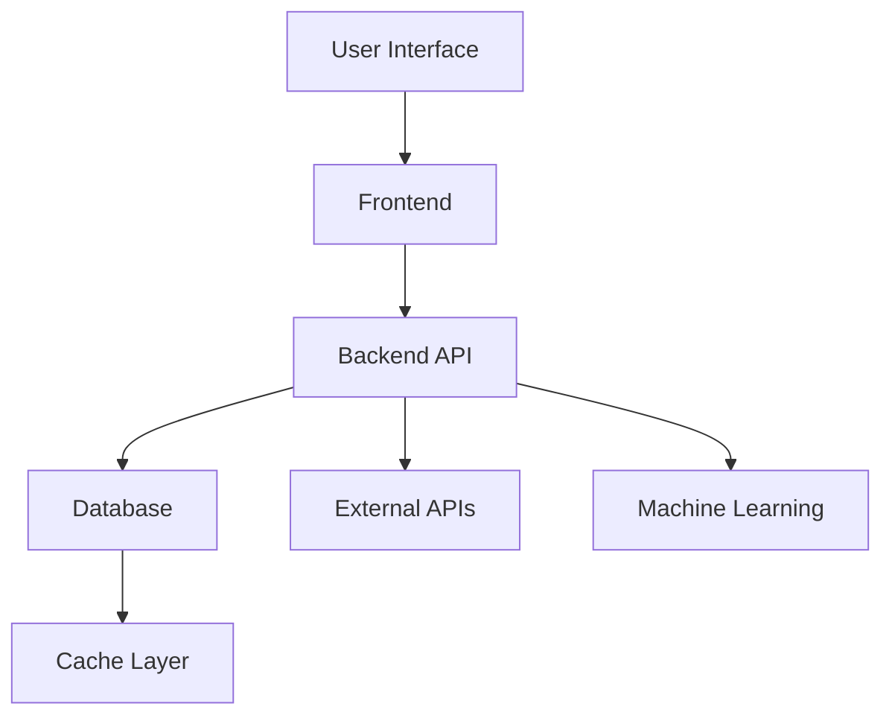

# 🚀 [Project Name]

**One-line description that clearly states the purpose and value**

[](link) [](link) [](link) [](LICENSE)

---

## 📋 Problem Statement

**What problem does this project solve?**

- Problem 1: Describe the specific pain point
- Problem 2: Explain why existing solutions are inadequate
- Problem 3: Identify the target audience and their needs

**Why this solution?**

- Unique approach: What makes this different?
- Technical innovation: Any novel techniques?
- Impact: Quantifiable benefits if possible

---

## 🎯 Features

### Core Features
- ✅ **Feature 1**: Brief description with key benefit
- ✅ **Feature 2**: Brief description with key benefit
- ✅ **Feature 3**: Brief description with key benefit

### Technical Highlights
- 🚀 **Performance**: Response time, throughput, scalability
- 🔒 **Security**: Authentication, data protection measures
- 📊 **Analytics**: Monitoring, logging, metrics
- 🧪 **Testing**: Test coverage percentage, testing approach

---

## 🏗️ Architecture



### System Components

| Component | Technology | Responsibility |
|-----------|------------|----------------|
| Frontend | React/TypeScript | User interface, state management |
| Backend | FastAPI/Flask | Business logic, API endpoints |
| Database | PostgreSQL/SQLite | Data persistence |
| Cache | Redis | Performance optimization |
| ML Models | PyTorch/Scikit-learn | Predictive analytics |
| Monitoring | Prometheus/Grafana | System health tracking |

---

## 🚀 Getting Started

### Prerequisites

- **Software**: List required software with versions
  - Node.js v18+
  - Python 3.10+
  - Docker (optional)

- **Hardware**: Minimum requirements if applicable
  - 4GB RAM
  - 2 CPU cores

- **Accounts**: Required API keys or services
  - NASA API key
  - Twilio account

### Installation

```bash
# Clone the repository
git clone https://github.com/JosephJonathanFernandes/[project-name].git
cd [project-name]

# Install dependencies
npm install
pip install -r requirements.txt

# Set up environment variables
cp .env.example .env
# Edit .env with your credentials
```

### Running the Project

```bash
# Development mode
npm run dev
python app.py

# Production mode
docker-compose up --build
```

### Configuration

**Environment Variables**:

| Variable | Description | Required | Default |
|----------|-------------|----------|---------|
| `API_KEY` | Your API key | Yes | - |
| `DB_URL` | Database connection | Yes | - |
| `DEBUG` | Debug mode | No | `false` |

**Configuration Files**:
- `config/production.json` - Production settings
- `config/development.json` - Development settings

---

## 🧪 Testing

### Test Coverage
- **Unit Tests**: 92% coverage
- **Integration Tests**: 85% coverage
- **E2E Tests**: 78% coverage

### Running Tests

```bash
# Run all tests
npm test
pytest tests/

# Run specific tests
npm test -- --testPathPattern=auth
pytest tests/api/test_users.py

# Test coverage report
npm run test:coverage
pytest --cov=app tests/
```

### Test Strategy
- **Unit Testing**: Jest/Pytest for individual components
- **Integration Testing**: Supertest for API endpoints
- **E2E Testing**: Cypress/Playwright for user flows
- **Mocking**: Mock external services for reliability

---

## 📊 Performance

### Benchmarks
- **Response Time**: 85ms (95th percentile)
- **Throughput**: 1200 req/sec
- **Memory Usage**: 150MB under load
- **Database Queries**: Optimized to < 5ms

### Optimization Techniques
- **Caching**: Redis for frequent queries
- **Database**: Indexing, query optimization
- **Frontend**: Code splitting, lazy loading
- **Backend**: Connection pooling, async I/O

---

## 🔧 Deployment

### Deployment Options

**Option 1: Docker (Recommended)**
```bash
docker-compose up --build
```

**Option 2: Manual Deployment**
```bash
# Build frontend
npm run build

# Start backend
gunicorn app:app --bind 0.0.0.0:8000
```

### Cloud Deployment
- **Vercel**: Frontend hosting
- **Render**: Backend hosting
- **AWS**: Full stack deployment guide
- **Heroku**: Alternative deployment

---

## 🎓 What I Learned

### Technical Skills
- **Skill 1**: Detailed explanation of what you learned
  - Specific techniques mastered
  - Challenges overcome
  - Best practices discovered

- **Skill 2**: Another technical area with details
  - Implementation patterns
  - Performance considerations
  - Debugging techniques

### Soft Skills & Lessons
- **Project Management**: How you organized the work
- **Team Collaboration**: If applicable, teamwork insights
- **Problem Solving**: Unique challenges solved
- **Time Management**: Balancing quality and deadlines

### Key Takeaways
> "Quote about the most important lesson learned"
> - Your Name

---

## 🔮 Future Improvements

### Planned Features
- [ ] Feature 1: Description and expected impact
- [ ] Feature 2: Technical implementation plan
- [ ] Feature 3: User benefit explanation

### Technical Debt
- [ ] Refactor: Component/area needing improvement
- [ ] Optimization: Performance bottleneck to address
- [ ] Documentation: Areas needing better docs

### Long-term Vision
- Scaling to X users
- Adding Y integration
- Expanding to Z use case

---

## 🤝 Contributing

### How to Contribute
1. Fork the repository
2. Create your feature branch (`git checkout -b feature/AmazingFeature`)
3. Commit your changes (`git commit -m 'Add some AmazingFeature'`)
4. Push to the branch (`git push origin feature/AmazingFeature`)
5. Open a Pull Request

### Contribution Guidelines
- Follow existing code style
- Write comprehensive tests
- Update documentation
- Keep commits focused and descriptive

### Good First Issues
- [Issue #123](link): Description of beginner-friendly task
- [Issue #456](link): Another good starting point

---

## 📝 License

This project is licensed under the MIT License - see the [LICENSE](LICENSE) file for details.

---

## 🙏 Acknowledgments

- **Inspiration**: Projects or people that inspired this work
- **Libraries**: Key open source libraries used
- **Tutorials**: Helpful resources that guided development
- **Contributors**: Team members or contributors

---

## 📞 Support

**Found a bug?** [Open an issue](https://github.com/JosephJonathanFernandes/[project-name]/issues)

**Have questions?** Contact me at [josephfernandes273@gmail.com](mailto:josephfernandes273@gmail.com)

**Want to contribute?** See [Contributing](#-contributing) section

---

> **"Project tagline or inspiring quote"**
> - Your Name, [Year]
